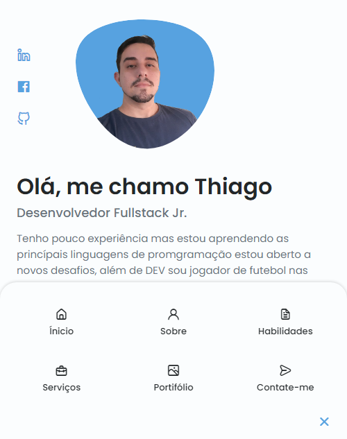

<h1 align="center"> Resposivo Pessoal Portfolio Website </h1>

Resposivo pessoal portifolio website usando HTML CSS e JavaScript | Dark/Light Mode.

  <a href="#-tecnologias">Tecnologias</a>&nbsp;&nbsp;&nbsp;|&nbsp;&nbsp;&nbsp;
  <a href="#-projeto">Projeto</a>&nbsp;&nbsp;&nbsp;|&nbsp;&nbsp;&nbsp;
  <a href="#-layout">Layout</a>&nbsp;&nbsp;&nbsp;|&nbsp;&nbsp;&nbsp;
  <a href="#memo-licença">Licença</a>

  

 

## 🚀 Tecnologias

Esse projeto foi desenvolvido com as seguintes tecnologias:

- HTML e CSS
- JavaScript

## 💻 Projeto

Um projeto desenvolvido pela [Bedimcode](https://www.youtube.com/watch?v=27JtRAI3QO8)

## 🔖 Layout

---

## 📲 Contatos & Social

#### E-mail: thiagotrindade628@gmail.com

#### Whatsapp: (91)99275-5537

 

  <a href="https://www.linkedin.com/in/thiago-trindade-351892208/">Linkedin</a>&nbsp;&nbsp;&nbsp;|&nbsp;&nbsp;&nbsp;
  <a href="https://www.facebook.com/thiago.trindade.902">Facebook</a>&nbsp;&nbsp;&nbsp;

